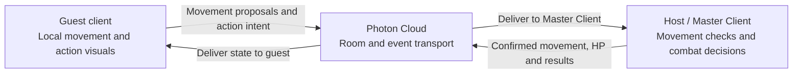

<div align="center">

# Caveman Olympics · Photon Multiplayer

**A two-player Unity PvP prototype built around Photon Unity Networking.**

Private rooms. Shared scenes. Responsive local controls. Host-authoritative combat.


[Quick start](#quick-start) · [Architecture](#multiplayer-architecture) · [Testing](#testing-and-verification) · [Slovenské návody](#further-documentation)

</div>

---

## About the project

This repository combines a caveman-themed Unity game with a focused **online Hunting duel for two players**. Its main technical showcase is the multiplayer implementation: connecting through Photon Cloud, assigning player ownership, synchronizing movement, and resolving attacks and dodges on a single gameplay authority.

One player creates a room and shares its code. The second player joins, and both clients automatically load the Hunting scene. Each controls their own character while receiving the opponent's confirmed movement and combat state.

The repository also contains earlier gameplay scenes, character assets, third-party packages, and a separate deterministic Combat Lab. The current online build starts in `menu` and continues into `hunting`.

> **Project status:** a playable networking prototype. Photon Cloud carries the messages; the room's **Master Client, running on one player's machine, evaluates gameplay**. This is not a dedicated-server deployment.

## Highlights

| Feature | What it demonstrates |
| --- | --- |
| Private two-player rooms | Create or join by a shared code; start automatically when both players arrive. |
| Synchronized scene loading | The host loads Hunting through PUN, and the other client follows. |
| Local character ownership | Player 1 controls `Character1`; Player 2 controls `Character2`. |
| Movement synchronization | Clients propose movement; the host checks displacement and broadcasts confirmed state. |
| Smooth remote presentation | Buffered interpolation and limited extrapolation present the opponent's movement. |
| Host-authoritative combat | Clients submit action intent; the host evaluates cooldowns, dodge windows, range, and HP. |
| Immediate visual feedback | Attack and dodge visuals play locally before the host confirms the outcome. |
| Runtime diagnostics | The HUD shows ownership, ping, both HP values, combat results, and rejected inputs. |
| Automated verification | Rule/protocol checks, a compilation check, and a two-process Photon Cloud smoke test. |

## Technology and requirements

Versions below come from the project configuration and bundled PUN source.

| Component | Version / requirement |
| --- | --- |
| Unity Editor | **6000.6.2f1** |
| Photon Unity Networking | **PUN 2.47**, included under `Assets/Photon` |
| Universal Render Pipeline | **17.6.0** |
| Cinemachine | **6.6.0** |
| Language | C# |
| Input | Unity's legacy Input Manager |
| Provided build target | Windows x64 development build |
| Online access | Internet connection and a valid Photon `AppIdRealtime` |
| Scripted checks | PowerShell; commands below use `pwsh` |

Use the recorded Unity version for reproducible setup. Install Windows build support for that editor to create the standalone demo. Unity resolves Package Manager dependencies from [`Packages/manifest.json`](Packages/manifest.json); PUN is already included and does not need a second import.

## Quick start

### 1. Get the project

```bash
git clone https://github.com/kuboch17/photon-network-multiplayer-project.git
cd photon-network-multiplayer-project
```

In Unity Hub, add the cloned project folder and open it with **Unity 6000.6.2f1**. Allow the initial asset import and compilation to finish.

### 2. Configure Photon

Select this asset in Unity's Project window:

```text
Assets/Photon/PhotonUnityNetworking/Resources/PhotonServerSettings.asset
```

In its Inspector, set **App Id Realtime** (`AppIdRealtime`) to your Photon application ID. The online demo uses PUN/Realtime; a Photon Chat application ID is not required for this flow.

The active lobby code sets the region to **`eu`**. Both clients need the same application ID, region, and compatible game version. The duel protocol identifies itself as `hunting-duel-1` and validates the room's `duel.version` property.

### 3. Start from the menu

Open **`Assets/Scenes/menu.unity`** and press **Play**. Wait for the lobby to connect; room controls become available after the connection to the Photon Master Server is ready.

> Enter the online match through the menu. Opening `hunting` directly does not establish the required two-player room or player assignments.

### 4. Connect two players

Run two standalone clients, or use one standalone client alongside Unity Play mode.

| Player 1 — host | Player 2 — guest |
| --- | --- |
| Enter a room code, for example `caveman123`. | Enter exactly the same room code. |
| Click **CREATE ROOM**. | Click **JOIN ROOM**. |
| Wait for Player 2. | Joining triggers the match automatically. |
| Control `Character1`. | Control `Character2`. |

Room codes must contain **1–24 characters** after trimming. Rooms are hidden from lobby listings and close to further joins when the match starts. Share the code directly with your opponent.

## Controls and gameplay

Both players use the same controls on their own client.

| Input | Action |
| --- | --- |
| **W / A / S / D** | Move using the existing camera-relative character controller. |
| **Space** | Jump through the existing character controller. |
| **J** | Submit a demo dash attack. |
| **K** | Submit a dodge. |
| **Leave match** in the HUD | Leave the room and return to the menu. |

The character controller also includes legacy gamepad bindings. Their mappings are defined in [`ProjectSettings/InputManager.asset`](ProjectSettings/InputManager.asset).

### Online combat parameters

These values belong to the active [`HuntingCombatDemo`](Assets/PvpLab/HuntingCombatDemo.cs); the separate Combat Lab has its own simulation parameters.

| Rule | Value |
| --- | --- |
| Starting health | 100 HP per player |
| Damage per confirmed hit | 25 HP |
| Attack range | 2.2 Unity world units |
| Attack windup | 100 ms |
| Action cooldown | 600 ms |
| Dodge protection window | 120 ms, with a fixed 30 ms backdating allowance |
| Additional resolution grace | 30 ms after the scheduled contact time |

Move the characters close together and press **J** to demonstrate a hit. Outside the attack range, the host reports **MISS**. A dodge covering the scheduled contact time produces **DODGE**. Watch the HUD to distinguish immediate visuals from confirmed changes to HP.

## Multiplayer architecture



### Lobby and player assignment

[`RoomManager.cs`](Assets/Photon/RoomManager.cs) manages the current menu flow. It creates a room with `MaxPlayers = 2`, assigns Photon actor numbers to the two player slots through custom room properties, and records a match identifier. The host calls `PhotonNetwork.LoadLevel("hunting")` with automatic scene synchronization enabled.

### Character ownership and movement

[`HuntingCombatDemo.cs`](Assets/PvpLab/HuntingCombatDemo.cs) reuses the scene's original character and creates a second matching character locally on each client. This fixed two-character setup uses **`PhotonNetwork.RaiseEvent`**, rather than `PhotonNetwork.Instantiate` or dynamically allocated Photon View IDs.

Input and movement scripts run on the locally owned character. Remote gameplay scripts are disabled and remote rigidbodies become kinematic; confirmed network state drives their presentation. The camera follows the locally owned character.

Movement is submitted at a target interval of **1/30 second**. The host checks sender ownership and increasing sequence numbers, then limits displacement using elapsed time, a 15-unit/second speed bound, and a positional tolerance. Confirmed position, rotation, velocity, animation values, HP, and diagnostic state travel back to the other client.

Remote motion uses a **100 ms interpolation buffer**, with extrapolation capped at **100 ms**. This smooths presentation while preserving immediate local movement.

### Combat authority and event transport

Clients send an action type and sequence number. They do not supply damage or a final hit result. The host checks ownership, action order, cooldown, and remaining HP, then evaluates dodge timing and distance using its confirmed positions.

| Event | Code | Delivery | Purpose |
| --- | --- | --- | --- |
| Movement proposal | `80` | Unreliable | Send local movement to the Master Client. |
| Authoritative state | `81` | Unreliable | Publish confirmed movement, health, and combat diagnostics. |
| Combat input | `82` | Reliable | Submit attack or dodge intent to the Master Client. |
| Combat visual | `83` | Reliable | Relay an accepted action's visual feedback to the other client. |

Local visuals are predictive; health changes follow the host's decision. The small dodge allowance is fixed, and the prototype does not implement full rollback or a historical collision simulation.

## Build the Windows demo

In Unity, choose **Tools → PvP → Build Windows Online Demo**.

The command creates a **Windows x64 development build** with these scenes in order:

1. `Assets/Scenes/menu.unity`
2. `Assets/Scenes/hunting.unity`

The executable is written to:

```text
Builds/HuntingPvP/HuntingPvP.exe
```

Copy the **entire `Builds/HuntingPvP` folder** to the other computer, including the data directory and runtime files. Launch the executable on each machine and follow the room-code flow above. Generated build folders are ignored by Git.

The build hook also checks that the Hunting scene contains `HuntingCombatDemo` with a valid player root and Animator.

## Testing and verification

Run these commands from the repository root, each in a separate PowerShell process:

```powershell
# Deterministic combat rules and timing boundaries
pwsh -File Tests/CombatSimulation.Tests.ps1

# Protocol, snapshots, sequences, input gating and movement checks
pwsh -File Tests/PunCombat.Tests.ps1

# Compile PvP scripts against installed Unity and imported Photon assemblies
pwsh -File Tests/CompilePvp.ps1

# Connect two executable clients through Photon Cloud
pwsh -File Tests/RunPunSmoke.ps1
```

The compilation script requires an imported project with assemblies in `Library/ScriptAssemblies`. It defaults to the recorded editor's standard Unity Hub installation path. For a different installation location:

```powershell
pwsh -File Tests/CompilePvp.ps1 -UnityData 'D:/Unity/6000.6.2f1/Editor/Data'
```

The smoke test requires a previously built `HuntingPvP.exe`, internet access, and valid Photon settings embedded in that build. It launches host and guest processes in a unique temporary room, verifies character ownership and state exchange, and checks both exit codes and PASS markers.

By default, the smoke test runs without graphics. The optional `-Graphics` switch requests a graphics run and captures screenshots in `Tests`.

### Recorded verification

[`PUN_VERIFICATION.md`](PUN_VERIFICATION.md) records **21 combat checks**, **20 protocol checks**, successful PvP compilation, a successful Windows build, and a two-process Photon Cloud smoke run. The saved client logs include:

```text
PUN-SMOKE host PASS pair synced local=Character1
PUN-SMOKE guest PASS pair synced local=Character2
```

These are recorded results, not a claim that every checkout has been retested. The rule/protocol suites exercise the isolated simulation and protocol helpers; the smoke test verifies the live connection and state flow. Neither replaces a visual gameplay test of the active Hunting scene.

Useful logs: `Tests/PvpCompile.log`, `Tests/PunUnityBuild.log`, `Tests/PunSmoke-host.log`, and `Tests/PunSmoke-guest.log`.

### Manual demo checklist

- Connect two clients and confirm that each controls a different character.
- Move and jump on both clients; inspect remote motion and camera ownership.
- Demonstrate an out-of-range miss, a close-range hit, and a correctly timed dodge.
- Compare HP and confirmed results on both clients.
- Leave on one client and check that the other exits the match.
- Repeat on two physical devices and different network connections.

## Repository map

```text
Assets/
├── Scenes/                  Main menu, Hunting and additional gameplay scenes
├── Photon/                  Bundled PUN SDK and project lobby managers
├── PvpLab/
│   ├── HuntingCombatDemo.cs  Active online character and combat implementation
│   ├── PunCombatProtocol.cs Shared protocol version, properties and helpers
│   ├── CombatSimulation.cs  Deterministic simulation used by rule tests
│   ├── CombatLab.cs         Separate local timing/scenario demonstration
│   └── Editor/              Combat Lab menu, scene validation and build command
├── Scripts/                 Original gameplay and utility scripts
├── Settings/                Render-pipeline settings
└── …                        Models, animation packs, effects and vendor assets
Packages/                    Unity package manifest and lock file
ProjectSettings/             Editor version, input mappings and build settings
Tests/                       PowerShell checks and saved verification artifacts
```

Additional scenes such as `footballl`, `PvPLobby`, and `test` are present in the repository but are not included in the current two-scene online build. Other lobby/session implementations remain in the source; start with `RoomManager` and `HuntingCombatDemo` when exploring the active flow.

For the independent local simulation, use **Tools → PvP → Open Combat Lab**, then enter Play mode.

## Troubleshooting

| Symptom | What to check |
| --- | --- |
| Lobby never connects or reports a disconnect | Check `AppIdRealtime`, internet access, and the disconnect cause in the Unity Console or client log. Restart the client to reconnect. |
| Guest cannot find the room | Confirm the exact room code, shared application ID, `eu` region, compatible build, and that the host is waiting with one player. |
| Room creation fails | Use a different code if the room already exists; follow the error shown in the lobby. |
| “This room uses a different version” | Use matching builds with the duel room properties and a capacity of two players. |
| Hunting does not prepare two characters | Launch through `menu` and wait for both players to join. Check the player-root and Animator references. |
| Keyboard controls do not work | Focus the game window and preserve the legacy Input Manager bindings. |
| PvP compilation script fails to find references | Import the project first and set `-UnityData` to the correct editor data folder. |
| Smoke test says the executable is missing | Run the custom Windows build command before the test. |
| Match ends when the host leaves | Expected behavior: this prototype ends the match instead of migrating gameplay authority. |

## Current limitations

- The online duel has exactly two fixed player slots. Rejoining and joining a running match are outside the current flow.
- The Master Client is a player-controlled host. Its validation does not make it a trusted dedicated server or provide production anticheat.
- Movement checks constrain displacement; they do not resimulate the complete character physics on a server.
- Dodge resolution uses a bounded allowance rather than full rollback or comprehensive lag compensation.
- The recorded cloud test used two processes on one computer. Testing across devices, packet loss, jitter, and long sessions remains necessary.
- Windows x64 is the provided build workflow; other platform targets have not been established by the recorded verification.

## Further documentation

| Document | Contents |
| --- | --- |
| [PUN network guide · SK](PUN_NETWORK_GUIDE_SK.md) | Online setup, ownership, networking rationale, and a suggested demonstration. Some timing details describe an earlier implementation; the active code is the reference for current values. |
| [Verification report · SK](PUN_VERIFICATION.md) | Recorded checks, smoke-test evidence, and verification boundaries. |
| [Combat Lab guide · SK](PVP_INTERVIEW_GUIDE_SK.md) | Local simulation scenarios and combat-timing discussion. Some scene instructions refer to an earlier integration; use the Combat Lab menu for the separate demonstration. |
| [Interview explanation · EN](PVP_INTERVIEW_REPLY_EN.md) | Supporting explanation of the combat/networking design. |

## Author and third-party assets

Created by **[kuboch17](https://github.com/kuboch17)**.

The repository includes Photon libraries and third-party character, animation, environment, and effects packages. Their respective terms apply. No root-level project license is currently included; do not assume that all bundled code and assets share an open-source license.
